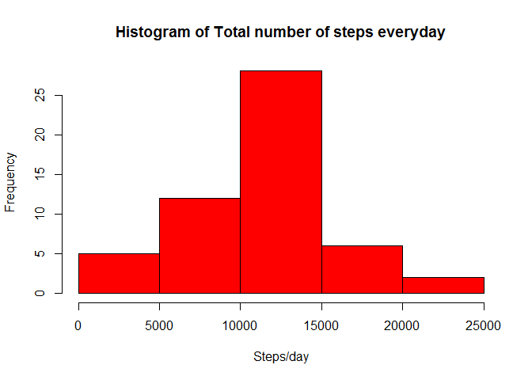
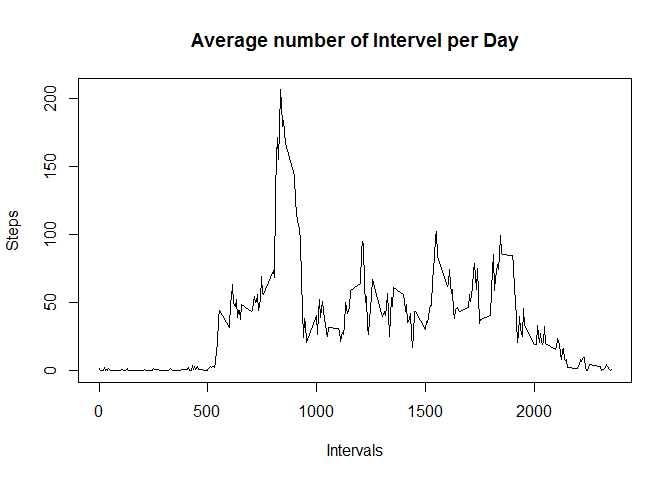
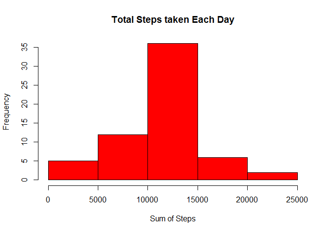
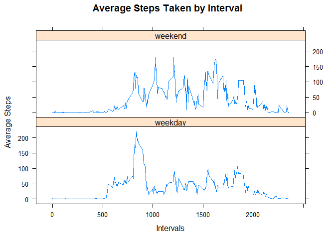

# Reproducible Research: Assignment 1
Syed karim  
March 10, 2017  


#Data#
The data for this assignment can be downloaded from the course web site:

Dataset: [Activity monitoring data](https://d396qusza40orc.cloudfront.net/repdata%2Fdata%2Factivity.zip)

The variables included in this dataset are:

steps: Number of steps taking in a 5-minute interval (missing values are coded as NA)<br>
date: The date on which the measurement was taken in YYYY-MM-DD format<br>
interval: Identifier for the 5-minute interval in which measurement was taken<br>

The dataset is stored in a comma-separated-value (CSV) file and there are a total of 17,568 observations in this dataset.


#Loading and preprocessing the data#
Download the zip file, unzip it, and load the file into a data frame

```r
library(lattice)
if(!file.exists("activity.csv"))
{
temp<-tempfile()
download.file("https://d396qusza40orc.cloudfront.net/repdata%2Fdata%2Factivity.zip", temp)
unzip(temp)
unlink(temp)
}

data<-read.csv("activity.csv")
```

#What is mean total number of steps taken per day?#
First addup the steps taken everyday. Mean and Median of the steps are calculated and a Histogram is drawn

```r
stepsPerDay<-aggregate(steps~date, data, sum)
hist(stepsPerDay$steps, main=paste("Histogram of Total number of steps everyday"), col = "red", xlab="Steps/day")
```

<!-- -->

```r
Smean<-mean(stepsPerDay$steps)
Smedian<-median(stepsPerDay$steps)
```
The Mean total number of steps taken is= 1.0766189\times 10^{4} 


The Median total number of steps taken is = 10765


#What is the average daily activity pattern?#


```r
stepPerInterval<-aggregate(steps~interval, data, mean, na.rm=T)
names(stepPerInterval)[2]<-"meanOfSteps"
plot(stepPerInterval$interval, stepPerInterval$meanOfSteps, type="l", main="Average number of Intervel per Day",xlab = "Intervals", ylab = "Steps")
```

<!-- -->

```r
max_step<-stepPerInterval$interval[which.max(stepPerInterval$meanOfSteps)]
```
Which 5-minute interval, on average across all the days in the dataset, contains the maximum number of steps? Answer=

```
## [1] 835
```

#Imputing missing values#

```r
#missing value
totalMissingValue<-sum(!complete.cases(data))
```
Total number of missing Value=

```
## [1] 2304
```


I have used the mean for the 5-minute interval to populate NA values for a given internval.


```r
newData<-merge(data, stepPerInterval, by = "interval")

newData$steps[is.na(newData$steps)]<-as.integer(round(newData$meanOfSteps[is.na(newData$steps)]))

keeps<-names(data)
newData<-newData[keeps]
#creating new Historam
newTotalSteps<-aggregate(steps~date, newData,sum)
hist(newTotalSteps$steps, main = "Total Steps taken Each Day", xlab="Sum of Steps", col="red")
```

<!-- -->

```r
#calculating mean and median
newMean<-mean(newTotalSteps$steps)
newMedian<-median(newTotalSteps$steps)
```
New Mean =

```
## [1] 10765.64
```
New Median=

```
## [1] 10762
```
#Are there differences in activity patterns between weekdays and weekends?#

```r
#defining weekend and weekdays
lastNewData<-newData
weekend<-weekdays(as.Date(lastNewData$date))%in%c("Satureday", "Sunday")
lastNewData$type<-"weekday"
lastNewData$type[weekend==T]<-"weekend"
lastNewData$type<-as.factor(lastNewData$type)

lastInterval<-aggregate(lastNewData$steps~lastNewData$interval+lastNewData$type, lastNewData, mean)
```

Below panel plot is used to identify activity pattern the differences between weekdays and weekends


```r
xyplot(lastInterval$`lastNewData$steps`~lastInterval$`lastNewData$interval`|lastInterval$`lastNewData$type`, lastInterval,
       main="Average Steps Taken by Interval", type="l", xlab="Intervals", ylab = "Average Steps", layout=c(1,2))
```

<!-- -->
